# New Styling Challenge

## Code Fixes and General Styling Improvements

Branch: `feature/design-and-code-improvements`

In this branch you will find the first improvements that generally address issues and styling fixes for the current state of the application repliear. Before starting with the challenge I have seen a lot of issues that are fixed in this branch. Please see further screenshots for more details. I have focussed on maintaining functionality while improving specific details. This branch might also be a candidate for a Pull Request in the main repository.

### Before and After Fixes

**Left Menu Navigation**

| Before                               | After                       |
| ------------------------------------ | --------------------------- |
| 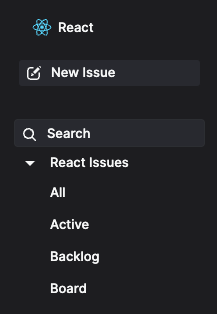 | 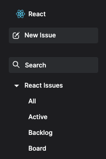 |

**Top Filter**

| Before                       | After                   |
| ---------------------------- | ----------------------- |
| 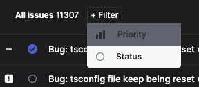 | 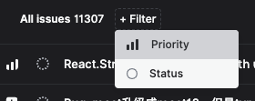 |

**Status Sorting**

| Before                     | After                   |                        |
| -------------------------- | ----------------------- | ---------------------- |
| 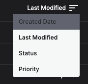 | 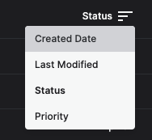 | 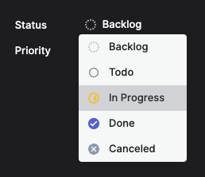 |

### Fixes

- ✅ Fixes initialisation issue with rows[0] being undefined
- ✅ Fixes issue with selecting multiple filters
- ✅ Updates to the newest modules
- ✅ Defines new project setup with environment variables

## Coding Challenge

Branch: `feature/coding-challenge`

This branch includes the main focus on the coding challenge and replaces existing components with Radix-UI components. Furthermore it includes more fixes and refactors some parts of the code base.

### Fixes

- ✅ Updating and successful saving of the issue description
- ✅ Fixes TS errors
- ✅ Refactors components

**List View**

| Before                               | After                         |
| ------------------------------------ | ----------------------------- |
| 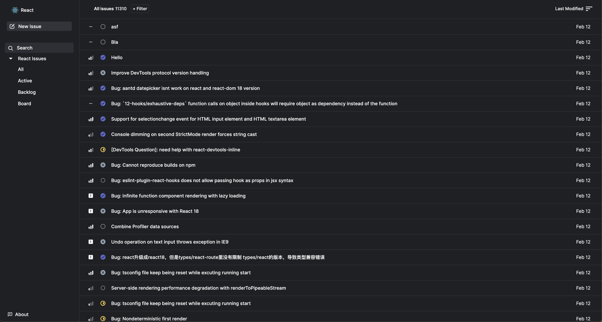 | 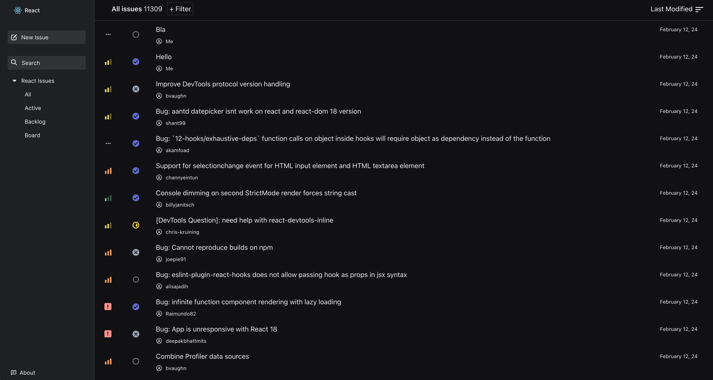 |

**Detail View**

| Before                                   | After                             |
| ---------------------------------------- | --------------------------------- |
|  | 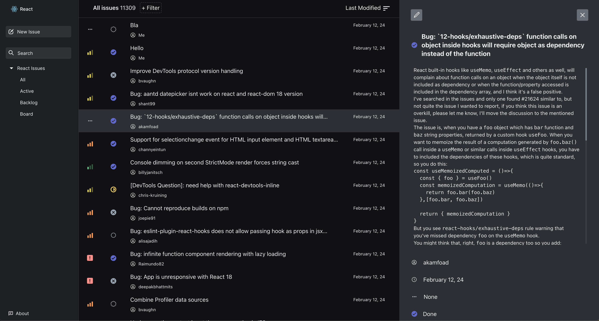 |

**Comments Section**

| Before                                          | After                                    |
| ----------------------------------------------- | ---------------------------------------- |
| 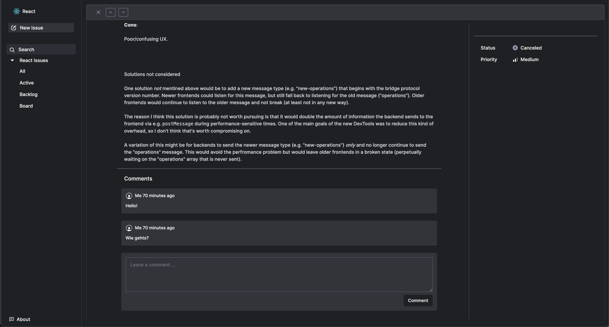 | 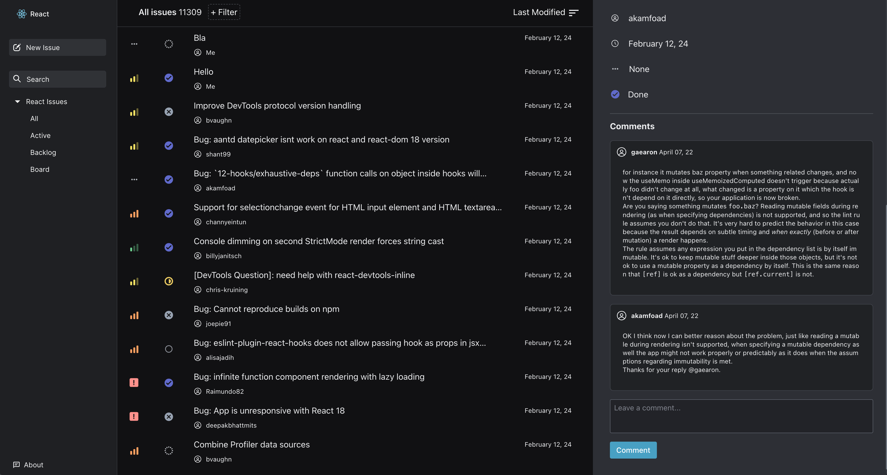 |

**New Issue Modal**

| Before                                    | After                              |
| ----------------------------------------- | ---------------------------------- |
| 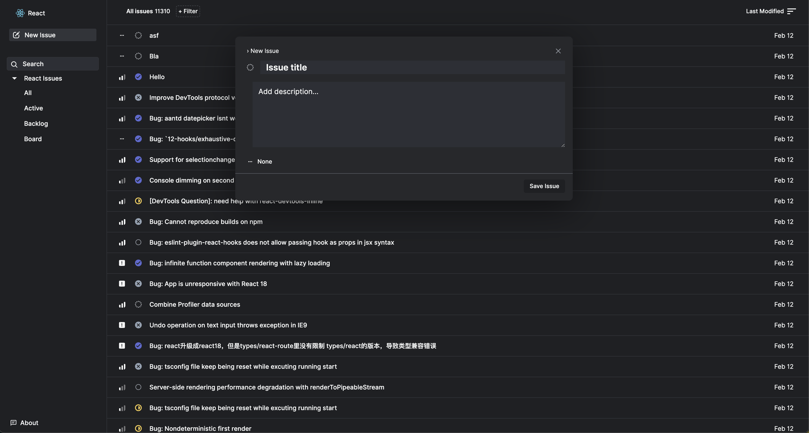 | 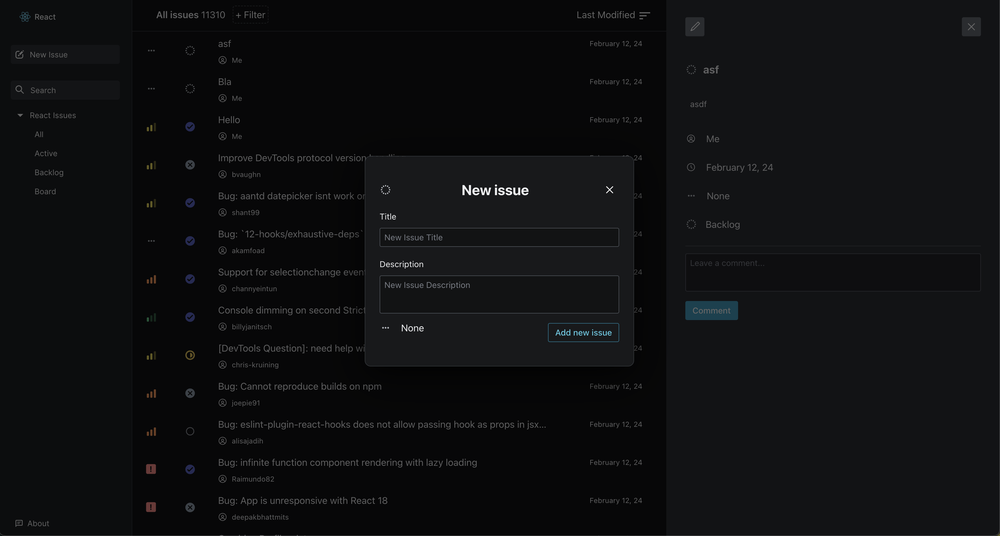 |

## More Todos

Due to the timing constraints not every possible improvement was made. Even though I had a close look on performance and rerenderings, especially trying to avoid deep nesting, it is necessary to improve most of the function logic and testing and optimising callbacks passed to components to avoid such rerenderings. The React tabs Profiler and Repainting Views are helpful to get a better understanding what still needs to be done.
